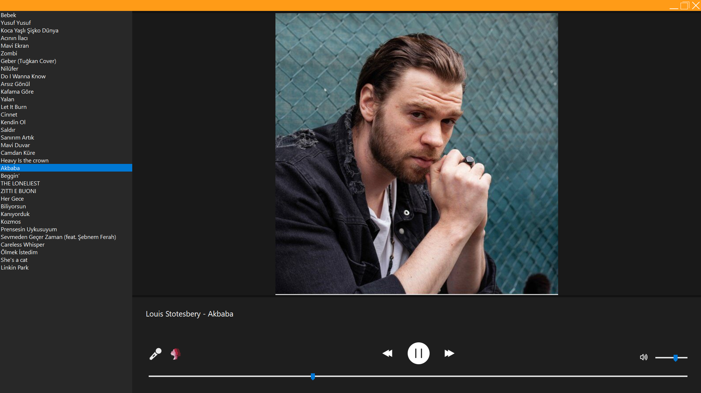

# Kaaner Music

  

A custom music player application developed in C# (Windows Forms).
This application allows users to stream music directly from the GitHub repository, offering a seamless and modern listening experience.

## Features

- **Online Music Streaming**: Streams music files directly from the repository.
- **Dynamic Playlist**: Automatically updates the song list from the cloud.
- **Sorting**: Sort songs by **Artist** or **Title**.
- **Album Art**: Displays album art for playing songs.
- **Modern UI**: Dark-themed, flat design with custom window controls.
- **Splash Screen**: Elegant loading screen on startup.

## Technologies Used

- **C#** (.NET Framework 4.7.2)
- **Windows Forms** (WinForms)
- **NAudio** (Audio playback)
- **Newtonsoft.Json** (JSON parsing)

## Installation

1. Download the latest release.
2. Run `KaanerMusic.exe`.
3. Ensure you have an active internet connection to fetch the song list.

## License

This project is licensed under the MIT License - see the [LICENSE](LICENSE) file for details.

Copyright (c) 2026 Kaaner4mir
